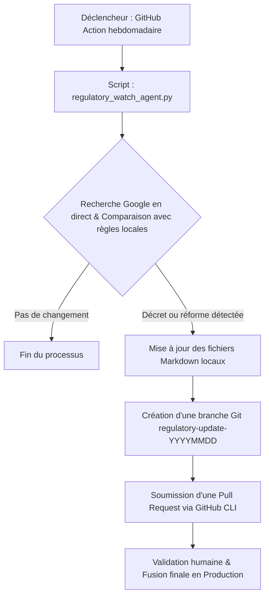

# Plan d'implémentation : Veille Réglementaire Automatisée & Conformité par PR

Ce plan détaille la mise en place d'un agent autonome de veille réglementaire. Cet agent vérifiera périodiquement la législation sur les retraites en France en comparant nos fichiers locaux avec des recherches Internet en direct, puis soumettra automatiquement une Pull Request (demande de fusion) sur GitHub si une mise à jour est requise.

---

## 1. Architecture du Flux de Conformité

---

## 2. Modifications proposées

### Backend

#### [NEW] [regulatory_watch_agent.py](file:///Users/hologramconseils/.gemini/antigravity/scratch/ris-pro-web/backend/regulatory_watch_agent.py)
*   Script Python indépendant utilisant le client `google-genai` avec l'outil de recherche Google activé.
*   Compare les fichiers `regles_depart_anticipe_2023.md`, `regles_gestion_retraite_2023.md` et `regles_optimisation_retraite_2023.md` avec l'actualité légale.
*   Enregistre les modifications détectées directement dans ces fichiers.

### CI-CD / GitHub Actions

#### [NEW] [regulatory-watch.yml](file:///Users/hologramconseils/.gemini/antigravity/scratch/ris-pro-web/.github/workflows/regulatory-watch.yml)
*   Workflow GitHub Actions s'exécutant tous les lundis à 8h (ou déclenchable manuellement).
*   Installe Python, lance le script de veille.
*   Crée une branche et soumet la Pull Request si des modifications de fichiers sont constatées.

---

## 3. Plan de vérification

### Tests automatisés
*   Exécuter le script localement avec des variables d'environnement simulées pour vérifier qu'il effectue la recherche et ne modifie pas les fichiers si aucun décret majeur n'a changé aujourd'hui.

### Vérification manuelle
*   Simuler une modification dans les fichiers locaux et vérifier que le script détecte la différence de conformité.
